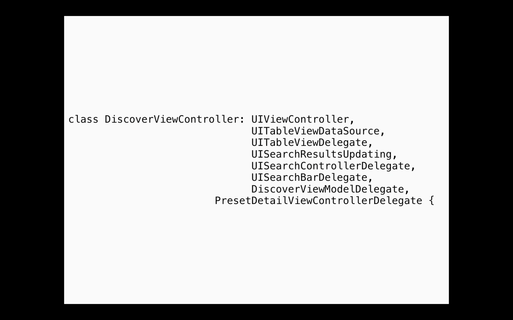
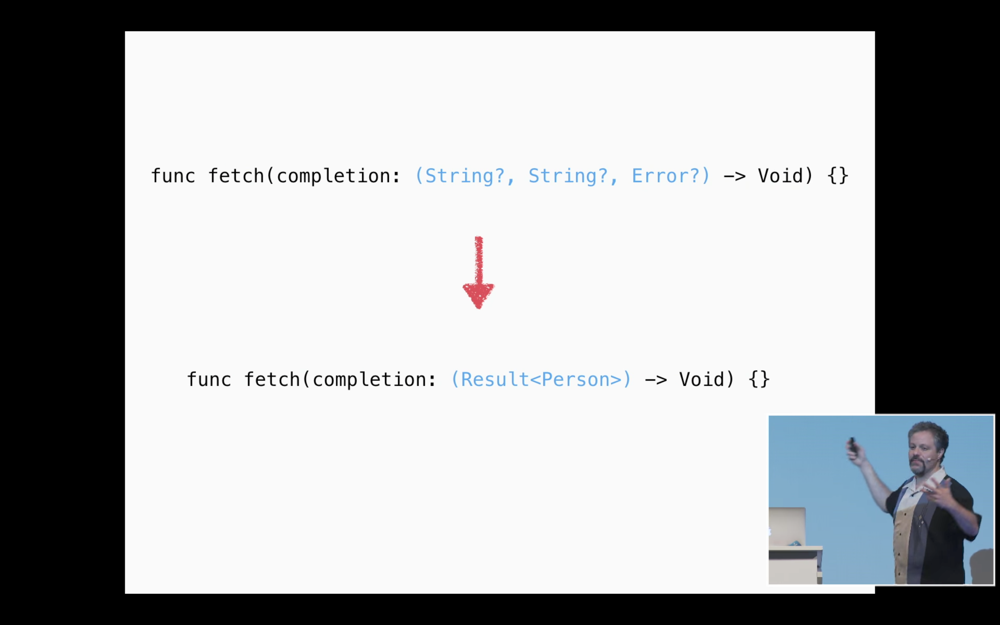

# Learning From Our Elders
## Rob Napier

---

^ Разбиваем логику на маленькие части каждая выполняет одну обязанность (Single Responsibility)
^ Профит не только в возможности реюза, маленькие юниты проще понимать и изменять

---

^ композиция - ключ к решению (про паттерны)
^ берем класс, выделяем из него отдельные классы с определенными ответственностями

---

^ некоторые понимают композицию так )
^ это противоположность композиции. Протоколы, которые специально были выделены для разнесения обязанностей тут смешиваются в один объект

---

^ рассмотрим пример, таблица с ячейками
^ разная логика при залогиненом юзере и нет

---

^ добавили поиск )
^ много ифов - много багов

---

^ решение - вынесение датасорсов в отдельные объекты, разные ответственности

---

^ if никуда не делся
^ теперь if только в одном месте

---

 

^ Еще один пример улучшений
^ Например у Label моделью является String, контроллер не знает как там Label отрисовывается, просто пихает стрингу туда
^ То же самое можно применить например к ячейкам, пусть ячейка сама решает как ее конфигурировать, при изменении ячейки не нужно переписывать контроллер

---

^ задача - есть 2 массива, нужно отсортировать по возрасту

---

^ EASY одно из решений на StackOverflow: объединить в массивы по парам, отсортировать массивы
^ можно написать тесты на это

---

^ Simple решение - поместить в структуру и сортировать уже там

---

^ тип может иметь диапазон значений, операций над типом
^ в нашем кейсе не всегда нужен весь диапазон. пример - состояние вьюхи (Int) : загрузка, ошибка, загружено. 3 значения, но Int имеет больший диапазон

---

^ другой пример, ID юзера - Int ID не имеет смысла складывать, умножать, но c Int это можно делать. Нужно выделять отдельный тип

---

^ строже типы - меньше тестов, дальше примеры

---

^ Следует избегать использования нестрогих типов (AnyObject, Dictionary) почти везде можно использовать струтруры

---

^ пример когда нужен выбор

---

^ пример запрос на сервер с
^ не понятно что за стринги и в каких сочетаниех это все имеет смысл

---

^ структуры подходят когда нам нужна логика "И" (имя и адрес)

^ все еще не понятно что будет если Person и Error nil или оба имеют ненудевое значение

---

^ энамы подходят когда нужна логика "ИЛИ"

---

^ итоговый вариант

---

